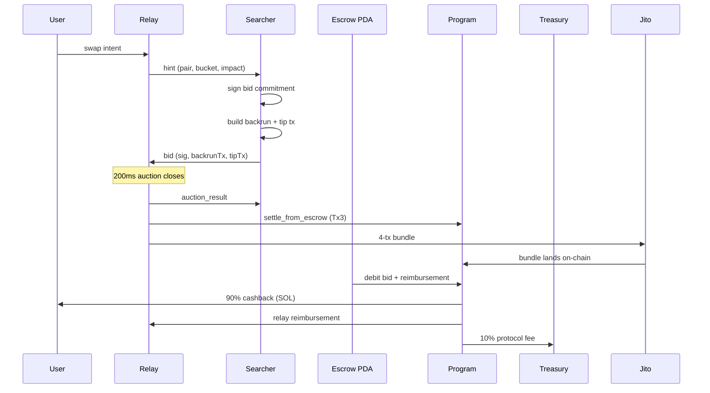

<p align="center">
  
</p>

<h1 align="center">FlowBack</h1>

<p align="center">
  <strong>MEV-Share for Solana.</strong><br/>
  Sealed-bid backrun auctions that turn MEV into user cashback.
</p>

<p align="center">
  <a href="#how-it-works">How It Works</a> &middot;
  <a href="#architecture">Architecture</a> &middot;
  <a href="#getting-started">Getting Started</a> &middot;
  <a href="#project-structure">Project Structure</a>
</p>

---

## Overview

FlowBack runs a sealed-bid backrun auction before every Solana swap lands on-chain. Instead of MEV searchers silently profiting off a user's trade, they compete in a 200ms auction for the exclusive right to backrun it. The winner pays **90% of their bid directly to the user as cashback** via an on-chain Anchor program.

The user gets the same Jupiter-routed swap they would have gotten normally - plus SOL back in their wallet.

**Privacy by construction:** the searcher's wallet never learns the user's pubkey. Not by policy - by protocol design. Settlement uses on-chain escrow + off-chain Ed25519 bid commitments verified via Solana's sigverify precompile.

Built for the [Colosseum Frontier](https://www.colosseum.org/) hackathon.

---

## How It Works



1. User enters a swap (e.g. 2 SOL → USDC) in the frontend
2. Relay fetches a Jupiter quote and returns a cashback estimate
3. User signs the prepared swap transaction in their wallet
4. Relay broadcasts a **privacy-preserving hint** (token pair, size bucket, price impact - no pubkey, no exact amount)
5. Searchers bid in a **200ms sealed auction** - highest `userCashbackLamports` wins
6. Relay assembles a 4-tx Jito bundle, submits to the Block Engine
7. On-chain program verifies the searcher's bid commitment via Ed25519 sigverify, debits their escrow, credits the user
8. User sees a cashback toast in ~15 seconds

If no searchers bid, the swap executes normally via fallback - no worse than going to Jupiter directly.

---

## Architecture

| Component | Description | Stack |
|-----------|-------------|-------|
| [**anchor/flowback**](anchor/flowback/) | On-chain program - escrow, settlement, replay guard | Anchor 1.0, Rust |
| [**relay**](relay/) | Off-chain auction relay - REST API + WebSocket server | Node.js, Express, uWebSockets.js |
| [**client**](client/) | Swap interface | Next.js 16, React 19, Tailwind v4 |
| [**sdk**](sdk/) | Searcher-facing TypeScript SDK | @solana/web3.js, tweetnacl |
| [**scripts**](scripts/) | Protocol init, searcher bots, demo setup | tsx, @solana/web3.js |
| [**docs**](docs/) | Documentation site | Next.js, Fumadocs |

Each directory is standalone with its own `package.json` (or `Cargo.toml`). No monorepo tooling. Install and run each independently - see the README in each directory for setup instructions.

---

## Getting Started

### Prerequisites

- **Node.js** 20+
- **pnpm** 10+
- **Rust** 1.79+ with `solana-cli` and `anchor-cli` 1.0
- **PostgreSQL** 15+ (for relay auction persistence)
- A Solana validator - [Surfpool](https://github.com/txtx/surfpool) for mainnet-forked local dev, or any devnet/localnet

### Quick Start (Local Demo)

```bash
# 1. Start a local validator (Surfpool forks mainnet)
surfpool start --network mainnet

# 2. Run the one-shot demo setup (funds wallets, deploys program, inits protocol)
cd scripts && pnpm install && pnpm demo

# 3. Start the relay (in a new terminal)
cd relay && pnpm install && pnpm dev

# 4. Start a searcher bot (in a new terminal)
cd scripts && pnpm searcher 0

# 5. Start the frontend (in a new terminal)
cd client && pnpm install && pnpm dev
```

Open [http://localhost:3000/swap](http://localhost:3000/swap), connect your wallet, and swap.

### Manual Setup

Each component has its own README with detailed setup instructions:

- **Program**: [`anchor/flowback/README.md`](anchor/flowback/README.md) - build, test, deploy
- **Relay**: [`relay/README.md`](relay/README.md) - env vars, database, start
- **Frontend**: [`client/README.md`](client/README.md) - env vars, dev server
- **SDK**: [`sdk/README.md`](sdk/README.md) - install, connect, bid
- **Scripts**: [`scripts/README.md`](scripts/README.md) - init, bots, demo

---

## Project Structure

```
flowback/
├── anchor/flowback/          On-chain Anchor program (Rust)
│   ├── programs/flowback/
│   │   └── src/
│   │       ├── lib.rs              Program entry points
│   │       ├── state.rs            ProtocolConfig, SearcherEscrow, UsedHint
│   │       ├── error.rs            Error variants
│   │       ├── events.rs           CashbackSettled, EscrowDeposited, EscrowWithdrawn
│   │       ├── constants.rs        PDA seeds, bid message prefix
│   │       └── instructions/       initialize, update_config, escrow_*, settle
│   └── tests/                      LiteSVM integration tests
│
├── relay/                    Off-chain auction relay
│   └── src/
│       ├── index.ts                Express + uWS entry point
│       ├── auction/                AuctionManager, bid validation
│       ├── bundle/                 Bundle construction + Jito submission
│       ├── anchor/                 Settlement tx builders
│       ├── jupiter/                Jupiter v2 /build API client
│       ├── ws/                     WebSocket handlers (searcher + user)
│       ├── db/                     Drizzle schema + client
│       ├── controllers/            REST controllers
│       ├── routes/                 REST routes
│       └── services/               Business logic
│
├── client/                   Next.js frontend
│   └── src/
│       ├── app/                    Pages (landing, /swap, /calculator)
│       ├── components/flowback/    SwapCard, MevDashboard, CashbackToast
│       ├── components/ui/          shadcn component library
│       └── lib/                    Relay API client, wallet helpers
│
├── sdk/                      Searcher TypeScript SDK
│   └── src/
│       ├── client.ts               FlowbackSearcher WebSocket client
│       ├── builders/               Bid commitment, escrow, tip tx builders
│       └── types.ts                Public type surface
│
├── scripts/                  Protocol init + searcher bots + demo setup
└── docs/                     Documentation site (Fumadocs)
```

---

## Bundle Order

```
Tx1: User Jupiter swap              user signature, jitodontfront guard
Tx2: Searcher backrun arb           searcher signature
Tx3: Ed25519 sigverify + settle     relay signature (fee payer = relay)
Tx4: Jito tip transfer              searcher signature
```

`jitodontfront` tells Jito's Block Engine to reject any bundle placing a transaction before Tx1 - eliminating sandwich attacks within Jito infrastructure.

---

## Privacy Model

The user's wallet pubkey **never reaches a searcher**, in any phase:

- **Hints** carry token pair, size bucket, and price impact - no pubkey, no exact amount
- **Bids** contain an Ed25519 signature over `flowback-bid:<hintId>:<bidAmount>` - no user data
- **Settlement (Tx3)** is built and signed by the relay, not the searcher
- **Escrow debits** happen via PDA - the searcher pre-funded it, the program debits it

This is a structural property, not a policy. Even a compromised searcher learns nothing about the user.

---

## Tech Stack

| Layer | Technology |
|-------|-----------|
| On-chain program | Anchor 1.0, Rust, `solana-instructions-sysvar` for Ed25519 introspection |
| Relay server | Node.js 20, Express 5, uWebSockets.js, Drizzle ORM |
| Frontend | Next.js 16, React 19, Tailwind v4, shadcn, wallet-adapter |
| SDK | TypeScript, @solana/web3.js, tweetnacl, ws |
| DEX routing | Jupiter v2 /build API |
| Bundle submission | Jito Block Engine via jito-ts gRPC |
| Database | PostgreSQL + Drizzle |
| Testing | LiteSVM (Rust), Surfpool (integration) |

---

## License

MIT
